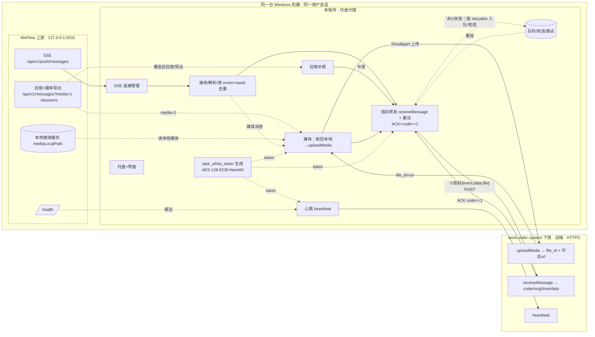

# weflow → work-order-system 消息转发代理（Windows 客户端）
# 需求规格说明书（SRS）

---

## 文档信息

| 项目 | 内容 |
|------|------|
| 文档名称 | weflow 消息转发代理 需求规格说明书 |
| 版本 | **v1.3**（交付定为免安装绿色版 + 二进制/状态分离 + 升级/换机迁移） |
| 状态 | 设计定稿；剩余为联调前置（凭据/域名）与少量需与下游对齐项 |
| 编写日期 | 2026-06-10 |
| 配套文档 | 《weflow → work-order-system 消息接收接口规格说明书（work-order-system 侧）v0.1》 |
| 适用产品形态 | **单托盘程序（推荐，与 WeFlow 同机、同用户会话）** / Windows 服务（可选增强） |

### 修订记录

| 版本 | 日期 | 说明 |
|------|------|------|
| v0.1–v0.3 | 2026-06-09 | 需求分析；依据 WeFlow API 定稿上游（本机 SSE、`?access_token=`、`event+rawid` 去重、拉取补偿） |
| v0.4 | 2026-06-09 | 媒体取回转存模块（Q-H）；心跳定稿、删 WebSocket（Q-F）；单实例（Q-J）；删多环境/Webhook（Q-K） |
| v0.5 | 2026-06-09 | 确认 `rawid == serverId`（Q-D2），去重正确性落定 |
| **v1.0** | 2026-06-10 | **依据下游对接契约定稿**：受理 Q-B/Q-L/Q-C/Q-E。**ACK 成功判定修正为 `HTTP200 且 code==1`**（原 SRS 误写 code==0）；下游鉴权 = `task_white_token`（AES-128-ECB+base64）；媒体 = **两步式上传端点**；消息体 = **信封 `{event,data,file}`**；幂等键 `event+rawid`（重复返 `duplicate=true` 视为成功）；错误码与 `retryable` 重试策略。新增需与下游对齐项：`sessionType` 取值、`avatarUrl` 可达性、是否多媒体 |
| **v1.1** | 2026-06-10 | **新增冷启动 / 首次安装 / 重装的消息同步与状态恢复（§3.6.1，FR-SYNC）**：明确首装默认"从现在开始、不回灌历史"（杜绝把全量微信历史灌入下游）、停机缺口由拉取补偿恢复、停机超回溯上限告警可人工补、重装/数据丢失回灌依赖下游 `event+rawid` 幂等避免重复工单、本地状态的安装/卸载/升级生命周期；新增下游幂等去重保留期待确认（Q-S5）；配置与验收同步补充 |
| **v1.2** | 2026-06-10 | **主界面新增"主动同步"按钮（FR-UI-08）**：一键"立即同步"（从断点补到最新）+"从指定时间点同步"，显示进度/结果、防并发；与托盘"手动补偿"、补偿测试统一为同一拉取补偿能力，命名统一为"主动同步" |
| **v1.3** | 2026-06-11 | **交付形态与迁移方案定稿**：交付改为 **.NET 8 自包含单文件免安装绿色版 + 首次运行自注册（写 `HKCU\…\Run` 自启，仅需当前用户权限）**，MSI/MSIX 改为可选；明确**二进制与状态分离**、本地状态存储位置由默认 `%ProgramData%` 改为 **`%LocalAppData%\<App>`**（免提权）；细化两类迁移场景——**版本升级**（替换 EXE、状态原地续用，新增 `schemaVersion` 启动迁移 FR-SYNC-09）与**偶尔换机**（DPAPI 凭据跨机不可解 → 新机重录凭据 + 冷启动靠下游幂等；以"DPAPI 解密失败"作为换机识别信号，augment FR-SYNC-01）；§8/§6/§7/§9 同步更新 |

### ⚠️ 最重要的一处修正（务必注意）

> **下游所有响应统一 HTTP 200，成败看 body.code。成功（肯定 ACK）= `HTTP 200 且 body.code == 1`。**
> 这与本 SRS 早期版本（FR-FWD-05 曾示例 `code==0`）**相反**。一律以 `code==1` 为准；仅在收到 `code==1` 后才推进断点、消息出队。

### 已确认结论汇总（截至 v1.0）

1. **上游** = WeFlow 本机 SSE（`127.0.0.1:5031` `/api/v1/push/messages`，`?access_token=`，事件 `message.new`/`message.revoke`，按 `event+rawid` 去重，`/health` 探活，`rawid==serverId`）。
2. **代理与 WeFlow 同机同用户运行**；形态 = 单托盘程序为主。
3. 上游无 Last-Event-ID → 断连用**拉取补偿**（`/api/v1/messages?media=1` + `/sessions`）。
4. **下游业务接口**（Q-B）= `POST /extra_server/weflow/receiveMessage`，请求体信封 `{event, data, file}`（`data` 为 WeFlow 原始数据直通）。
5. **ACK**（Q-B）= `HTTP200 且 code==1`；幂等（Q-E）键 `event+rawid`，重复返 `duplicate=true` 视为成功。
6. **媒体**（Q-L）= **两步式上传**：先 `POST /extra_server/weflow/uploadMedia`（multipart）拿 `file_id`+远端可达 `url`，再在消息体 `file` 引用。
7. **心跳**（Q-C）= `POST /extra_server/weflow/heartbeat`（JSON）；下游不下发反向控制（Q-F）。
8. **下游鉴权** = `task_white_token`（URL 查询参数；AES-128-ECB/PKCS7 + base64；每次请求实时生成；URL 编码）。

---

## 1. 引言

### 1.1 编写目的

本程序是与 **WeFlow 同机部署**的 Windows 消息中转代理：通过 WeFlow 本机 SSE 接收新消息事件，文本类**直通**、媒体类**两步式上传后引用**，以信封 `{event,data,file}` 调用 **work-order-system** 的 `receiveMessage`，以 `code==1` 判定成功；通过**拉取补偿**保证断连不丢，通过**心跳**让下游感知链路健康。本文档与下游《对接接口规格说明书》配套，可作为开发、测试、验收依据。

### 1.2 项目背景

WeFlow（本机微信消息源）与 work-order-system（远端工单系统）未直接打通；且 WeFlow 媒体/头像地址为 `127.0.0.1` 本机地址，远端不可达。本程序把 SSE 推送转为对下游的 HTTPS 调用，并通过"先上传媒体到下游、拿回可达 url 再引用"解决媒体可达问题。

### 1.3 术语与缩略语

| 术语 | 说明 |
|------|------|
| WeFlow / weflow | 上游本机微信存档应用，`127.0.0.1:5031` HTTP/SSE API。 |
| work-order-system | 下游工单系统（远端，FastAdmin 体系），服务方/被调用方。 |
| 本程序 / 代理 / Agent | 与 WeFlow 同机同用户运行的 Windows 转发程序。 |
| rawid | WeFlow 消息原始 id（=拉取接口 `serverId`），去重键 `event+rawid`。 |
| 拉取补偿 / Catch-up | 用 `/api/v1/messages?media=1`、`/sessions` 补回 SSE 断连缺口。 |
| 信封 | 下游 `receiveMessage` 请求体结构 `{event, data, file}`。 |
| 两步式上传 | 媒体先 `uploadMedia` 拿 `file_id`+`url`，再在消息体 `file` 引用。 |
| ACK | 下游业务确认；成功 = `HTTP200 且 body.code==1`。 |
| task_white_token | 下游鉴权令牌（AES-128-ECB/PKCS7 + base64，URL 查询参数）。 |
| 心跳 | 代理周期性向下游 `heartbeat` 上报链路健康。 |
| DLQ | 死信队列。 |

### 1.4 范围

**包含**：WeFlow 本机 SSE 接收；文本直通 / 媒体两步式上传后引用；信封转发并以 `code==1` 判定；幂等去重；拉取补偿；心跳上报；`task_white_token` 鉴权；配置化、测试、连接管理、重试、日志、监控、托盘界面。

**不包含**：反向业务链路 / 反向控制 / WebSocket（Q-F）；字段映射（下游内部做映射，对代理透明；代理只直通 `data`）；WeFlow 与下游自身开发；多上游/多 WeFlow 实例（Q-J）；多环境切换、Webhook 告警（Q-K）；跨平台。

---

## 2. 系统概述

### 2.1 系统定位

与 WeFlow 同机同用户运行的轻量常驻代理：握 localhost SSE → 文本直通 / 媒体两步式上传 → 信封 POST 远端工单系统（`code==1` 判定）→ 断连拉取补偿兜底 → 周期心跳上报。目标：**不丢、媒体可达、可观测、易排错**。

### 2.2 系统架构与数据流

### 2.3 核心工作流程

1. 代理随登录启动（与 WeFlow 同机同用户）→ 连接 `…/api/v1/push/messages?access_token=…`。
2. 收到事件 → 解析 SSE 帧取出 `data` JSON → 按 `event+rawid` 去重 → 记 `timestamp` 断点候选。
3. 判断媒体（按 `content` 占位符如 `[图片]`）：
   - 文本：直接进入转发，组装信封 `{event, data:<WeFlow原始data>}`。
   - 媒体：调 `/api/v1/messages?talker={sessionId}&media=1` 取回 `mediaLocalPath/mediaType/mediaFileName` → 读本地文件 → **`uploadMedia`（multipart：`file`+`rawid`）** 拿 `file_id`+`url` → 组装信封 `{event, data, file:{file_id,url,mediaType,mediaFileName,size}}`。
4. 用 `task_white_token` 调 `receiveMessage` 转发 → 解析响应：`code==1` 即成功（含 `duplicate=true` 也算成功）→ 推进断点、出队；否则按 `code`/`data.retryable` 重试或入死信。
5. SSE 断开/WeFlow 重启 → 重连 → 拉取补偿（`media=1` 一并取媒体，去重后补发）。
6. 周期心跳 `heartbeat` 上报链路健康；可用响应 `server_time` 校时。
7. 全程日志/统计；托盘实时展示状态。

### 2.4 角色与使用场景

| 角色 | 关注点 |
|------|------|
| 运维/管理员 | 配置 WeFlow Token、下游 base/site key/AES 密钥、自启；看连接/转发/补偿/媒体/心跳状态；重投死信。 |
| 测试/集成 | 测试接收/发送/连接(ping)/补偿/媒体；验证 ACK=code==1、媒体 url 下游可访问。 |
| 开发 | 看日志、SSE 原始事件、uploadMedia/receiveMessage 请求与响应、token 生成。 |
| work-order-system | 收心跳判断链路；按 `event+rawid` 幂等落库（其内部映射对代理透明）。 |

---

## 3. 功能需求

> 编号 `FR-<模块>-<序号>`；优先级 **P0/P1/P2**。FR 编号与章节号无关。

### 3.1 长链接管理（WeFlow 本机 SSE 接入）

| 编号 | 优先级 | 需求描述 |
|------|--------|----------|
| FR-CONN-01 | P0 | GET 连接 `{base}/api/v1/push/messages`（默认 `127.0.0.1:5031`），`Accept: text/event-stream`，单连接保持接收。 |
| FR-CONN-02 | P0 | 鉴权 `?access_token=<Token>`；Token 可配置、加密存储；host/port 可配置。 |
| FR-CONN-03 | P0 | 连接前/失败时查 `GET /health`（免鉴权），区分"WeFlow 未就绪"与"已连无推送"。 |
| FR-CONN-04 | P0 | 断线自动重连（WeFlow 重启/关推送等）：指数退避，最大次数可配（0=无限）。 |
| FR-CONN-05 | P0 | 读超时探活：窗口内无数据即重连。 |
| FR-CONN-06 | P0 | 实时连接状态展示（含 weflowNotReady）。 |
| FR-CONN-07 | P0 | SSE 解帧：识别 `event:`/`data:`、空行分隔、多行 `data` 拼接、忽略注释行；取出 `data` JSON 字符串。 |
| FR-CONN-08 | P1 | 连接/读超时可配置；本机连接无需 TLS；日志对 token 脱敏。 |
| FR-CONN-09 | P2 | 手动断开/重连。 |

### 3.2 消息接收与处理

| 编号 | 优先级 | 需求描述 |
|------|--------|----------|
| FR-RECV-01 | P0 | 解析 `data` JSON：`event`/`sessionId`/`sessionType`/`rawid`/`avatarUrl`/`sourceName`/`groupName`(群)/`content`/`timestamp`(秒)。**宽松解析**，容忍多/缺字段。 |
| FR-RECV-02 | P0 | 上游不回 ACK（SSE 单向）。 |
| FR-RECV-03 | P0 | 按 `event+rawid` 去重（持久化去重表，覆盖重启/补偿/重投）。 |
| FR-RECV-04 | P0 | 基本校验：`data` 可解析、`rawid`/`timestamp` 存在；非法事件记录并跳过。 |
| FR-RECV-05 | P0 | 媒体判定：按 `content` 占位符（可配置列表，默认 `[图片]`/`[视频]`/`[语音]`/`[动画表情]`）；可选"每条探测"模式。 |
| FR-RECV-06 | P1 | 事件过滤：可配置是否转发 `message.revoke`；按 `sessionType`/`sessionId` 白黑名单。 |
| FR-RECV-07 | P1 | 维护"最后成功转发 `timestamp`/`rawid`"断点。 |

> **直通即原样**：转发时 `data` 字段放 WeFlow 原始 JSON（不改字段）；下游内部自行映射，对代理透明。

### 3.3 下游鉴权（task_white_token）— 依据下游契约

> 适用于全部三个下游接口（uploadMedia / receiveMessage / heartbeat），均以 URL 查询参数携带。

| 编号 | 优先级 | 需求描述 |
|------|--------|----------|
| FR-AUTH-01 | P0 | 构造明文 JSON：`{"key":"<siteKey>","time":<unix秒>}`（**字段顺序固定 key 在前、time 在后、无多余空格**）。 |
| FR-AUTH-02 | P0 | 加密：`base64( AES-128-ECB / PKCS7( utf8(明文) ) )`；**AES 密钥取约定密钥串前 16 字节（ASCII）**（与下游 PHP `openssl AES-128-ECB` 行为一致）。 |
| FR-AUTH-03 | P0 | 作为 `?task_white_token=<值>` 附加到每个请求 URL；**base64 含 `+ / =`，必须 URL 编码**。 |
| FR-AUTH-04 | P0 | **每次请求实时生成新 token**（`time` 取当前秒）；适配下游 `time` 时效校验（容差待定，§11）。 |
| FR-AUTH-05 | P0 | AES 密钥与 site key **加密存储**（DPAPI）；线下安全获取，不入日志/不入共享文档。 |
| FR-AUTH-06 | P1 | 实现自测：用下游提供的固定明文测试向量比对，应得到完全一致的 token（见配套文档 §7.2）。 |

### 3.4 媒体处理（取回与两步式上传）— Q-L 定稿

> 解决"WeFlow 媒体为 `127.0.0.1` 本机地址、远端不可达"：媒体先上传到下游，拿回下游域名下、远端可达的 `url`，消息体再引用 `file_id`。

| 编号 | 优先级 | 需求描述 |
|------|--------|----------|
| FR-MEDIA-01 | P0 | 媒体消息调 `GET /api/v1/messages?talker={sessionId}&media=1`（时间窗 + `rawid` 匹配），取 `mediaType`/`mediaFileName`/`mediaLocalPath`。 |
| FR-MEDIA-02 | P0 | 本地取回：优先**直接读 `mediaLocalPath` 文件**（同机同用户有权限）；备选 localhost `mediaUrl`。 |
| FR-MEDIA-03 | P0 | 导出时序：media=1 触发后媒体可能未即时就绪，支持取回重试/等待（可配超时/重试）。 |
| FR-MEDIA-04 | P0 | **第 1 步上传**：`POST {base}/extra_server/weflow/uploadMedia?task_white_token=...`，`multipart/form-data`，字段 `file`(二进制) + `rawid`(=serverId)；成功返回 `{code:1, data:{file_id, url, mediaFileName?, size?, duplicate}}`。`url` 为下游域名下、**远端可达**。 |
| FR-MEDIA-05 | P0 | **第 2 步引用**：在 §3.5 信封 `file` 子对象填 `{file_id, url, mediaType, mediaFileName, size}`（`file_id`/`url` 取自上传响应；`mediaType`/`mediaFileName` 取自 WeFlow；`size` 取自本地文件）。 |
| FR-MEDIA-06 | P0 | **事务性**（下游 §4.3 依赖）：先上传媒体成功 → 再发消息引用；任一失败整条入重试/死信，不发"半条"；仅最终 `receiveMessage` 返 `code==1` 才算完成。 |
| FR-MEDIA-07 | P0 | 媒体上传幂等：下游按 `rawid+mediaFileName` 幂等，命中返回同一 `file_id`+`duplicate=true`；代理据此避免重复上传/可复用。 |
| FR-MEDIA-08 | P1 | 大小/类型：单文件上限可配（**下游建议 50MB，最终值待确认 §11**）；超限处理可配（跳过仅发正文+占位 / 整条入死信）；危险可执行类型会被下游安全拦截（返 `code=1002` 不可重试），需识别并入死信、不无脑重试。 |
| FR-MEDIA-09 | P1 | 补偿路径复用：拉取补偿对媒体消息直接 `media=1` 取媒体，复用同一上传/引用/去重逻辑。 |
| FR-MEDIA-10 | P1 | 媒体临时文件转存成功后清理；目录与总量上限。 |
| FR-MEDIA-11 | P2 | （待对齐 §11）若单条消息可能含多个媒体，`file` 需支持数组并多次上传；首版按单媒体对象。 |

### 3.5 消息转发（work-order-system · receiveMessage）— Q-B 定稿

| 编号 | 优先级 | 需求描述 |
|------|--------|----------|
| FR-FWD-01 | P0 | `POST {base}/extra_server/weflow/receiveMessage?task_white_token=...`，`Content-Type: application/json`，以 **JSON 原文**发送（下游以 `php://input` 读原始 body，勿用 form-urlencoded）。 |
| FR-FWD-02 | P0 | **请求体信封 `{event, data, file}`**：`event`=`message.new`/`message.revoke`；`data`=WeFlow 原始数据**原样直通**；`file`=媒体文件信息（**仅媒体消息含**，引用 §3.4 上传结果）。 |
| FR-FWD-03 | P0 | 鉴权用 `task_white_token`（§3.3）。 |
| FR-FWD-04 | P0 | **ACK 成功判定（重点）：`HTTP 200 且 body.code == 1`**。不得用 HTTP 状态码判定（下游恒 200）。成功判定规则可配置，**默认且按契约固定为 code==1**。 |
| FR-FWD-05 | P0 | 仅收到 `code==1` 后才标记完成、推进断点、出队（含 `data.duplicate==true` 幂等命中，亦视为成功**不再重发**）。 |
| FR-FWD-06 | P0 | 失败/非 1 处理：依据 `code` 与 `data.retryable` 决策——`retryable==true`（如 `0/1004/1005`，或 `1001` 因 time 过期重生 token）→ 退避重试；`retryable==false`（如 `1001`非过期/`1002`/`1003`）→ 不重试、入死信/告警。**未识别的非 1 码按 `code=0` 处理，缺省 retryable 按可重试**。 |
| FR-FWD-07 | P0 | 请求/等待 ACK 超时可配置（同步 ACK）。 |
| FR-FWD-08 | P1 | 重试次数/间隔/退避可配置；耗尽进死信（§3.6）。 |
| FR-FWD-09 | P1 | 解析响应 `data`：记录 `message_id`/`duplicate`/`received_at` 入审计。 |
| FR-FWD-10 | P2 | 顺序/并发可配（默认保序串行）。 |

**下游统一响应与错误码（代理须据此实现）：**

| `code` | 含义 | `data.retryable` | 代理动作 |
|--------|------|------------------|----------|
| `1` | 成功（含幂等命中） | — | 完成、推进断点、出队 |
| `0` | 通用失败 | `true` | 退避重试 |
| `1001` | 鉴权失败 | `false`*（*time 过期则重生 token 后重试） | 一般入死信/告警；过期则重试 |
| `1002` | 请求体解析失败/缺参/危险媒体类型 | `false` | 入死信，勿重发 |
| `1003` | 媒体引用无效（file_id 失效） | `false` | 重新走媒体上传 |
| `1004` | 媒体上传失败（存储/IO） | `true` | 退避重试 |
| `1005` | 服务端内部错误 | `true` | 退避重试 |

### 3.6 可靠性：拉取补偿 / 重试 / 队列 / 死信

| 编号 | 优先级 | 需求描述 |
|------|--------|----------|
| FR-REL-01 | P0 | 未拿到 `code==1` 的消息本地落库（SQLite/LiteDB），崩溃/重启不丢。 |
| FR-REL-02 | P0 | 断点（`timestamp`/`rawid`）持久化。 |
| FR-REL-03 | P0 | 拉取补偿：SSE 重连后 / 启动后 / 定时巡检触发——以断点时间戳为 `start`，`/api/v1/sessions` 找有更新会话，再 `GET /api/v1/messages?talker=..&start=..&media=1`，去重后补发（媒体一并处理）。 |
| FR-REL-04 | P0 | 补偿与实时共用 `event+rawid` 去重表；`rawid==serverId` 已确认；叠加下游幂等（`duplicate=true`）双保险，**不重复写工单**。 |
| FR-REL-05 | P0 | 死信队列：留存失败原因（含 `code`/`retryable`）、时间、`event+rawid`、原始 `data`、媒体状态。 |
| FR-REL-06 | P1 | 死信处理：界面查看、手动/批量重投、导出、删除。 |
| FR-REL-07 | P1 | 下游熔断保护：连续失败短暂停发+降频，恢复后半开自愈。 |
| FR-REL-08 | P1 | 补偿上限（回溯窗口/条数）可配，超限告警。 |
| FR-REL-09 | P2 | 至少一次语义 + 去重/下游幂等。 |

### 3.6.1 冷启动与首次安装 / 重装的消息同步（状态恢复）

> 把"每次启动该从哪条消息开始转发"显式定义清楚，避免两类事故：①首装时把全量微信历史一次性灌入下游；②重装/数据丢失后静默漏消息或重复建工单。

| 编号 | 优先级 | 需求描述 |
|------|--------|----------|
| FR-SYNC-01 | P0 | **启动态识别**：每次启动检测本地持久化状态（断点 `timestamp`、去重表、未投递队列）是否存在，区分三种启动：①**正常重启/升级保留**（状态齐全）→ 续投未完成队列 + 从断点拉取补偿（FR-REL-03）覆盖停机期；②**首次安装/冷启动**（无任何本地状态）→ 应用初始同步策略（FR-SYNC-02）；③**重装/数据丢失/换机**（无断点或去重表）→ 按冷启动处理，并依赖下游幂等去重（FR-SYNC-05）。**换机识别信号**：若本地状态尚在、但 **DPAPI 凭据解密失败**（密文绑定原用户/机器），几乎可判定为换机/换用户，应明确提示"重新录入凭据"而非静默报错。 |
| FR-SYNC-02 | P0 | **初始同步策略（首装/无断点时）**：可配置，**默认"从现在开始"——断点 = 首启时间戳，只转发此后 SSE 收到的新消息，默认不回灌历史**。**严禁**断点缺省为 0/epoch 后触发补偿导致全量历史回灌。可选起点：从指定时间点 / 回溯最近 N 小时（初始回溯窗口）/（高级、需显式二次确认且不推荐）全量回灌。 |
| FR-SYNC-03 | P0 | **停机缺口恢复**：正常重启/升级后，停机期间 WeFlow 收到的消息由"从断点拉取补偿"补回；前提是断点仅在**成功转发并收到 `code==1` 后**才推进（FR-FWD-05），使停机点之后的消息可被完整补回。 |
| FR-SYNC-04 | P1 | **停机超过补偿回溯上限**：若离线时长超过补偿最大回溯窗口（FR-REL-08，默认 24h），早于窗口的消息无法补回——**必须告警提示**，并允许人工临时放宽回溯窗口或指定时间点手动补偿，**不得静默丢弃**。 |
| FR-SYNC-05 | P1 | **重装/数据丢失的去重保障**：本地去重表丢失后若回灌，可能重复发送已转发过的消息；依赖**下游按 `event+rawid` 幂等**（返回 `duplicate=true`）避免重复写工单。**前提：下游幂等去重表保留期需覆盖回灌窗口**（见 §11 Q-S5）。 |
| FR-SYNC-06 | P1 | **首启向导 / 手动设置同步起点**：首次启动时界面提示选择初始同步起点（从现在 / 回溯 N / 指定时间点）；运行期亦可手动触发"从指定时间点同步/补偿"，用于补漏或重新对齐（主界面入口即 FR-UI-08 的"主动同步"按钮）。 |
| FR-SYNC-07 | P1 | **本地状态的安装/卸载/升级生命周期 + 二进制/状态分离**：程序（单文件 EXE）与本地状态解耦——本地状态（配置、断点、去重表、队列、死信）统一存于 **`%LocalAppData%\<App>`**（免提权可写；**不默认 `%ProgramData%`**，后者首次写入常需提权、与"免安装免提权"相悖），并设访问权限。**升级（替换 EXE）保留全部状态**（状态目录原地不动 = 等同正常重启）；**卸载**可选"保留/彻底清除"（默认保留断点与队列便于重装续投）；**重装**若状态尚在则续用、否则走冷启动。 |
| FR-SYNC-08 | P2 | **重置功能**：提供"重置同步断点 / 清空去重表 / 清空队列"运维操作（均需二次确认），用于排障或主动重新对齐起点。 |
| FR-SYNC-09 | P0 | **本地存储版本与升级迁移**：本地持久化（LiteDB/SQLite、配置文件）须带 `schemaVersion`；启动时若检测到旧版本，自动执行平滑迁移（表结构/字段升级），保证版本升级后**老数据不丢、不炸库**。迁移失败须告警并保留原数据、**不静默覆盖**。 |

### 3.7 配置管理

| 编号 | 优先级 | 需求描述 |
|------|--------|----------|
| FR-CFG-01 | P0 | 图形化配置界面覆盖 §6 全部项；支持本地配置文件。 |
| FR-CFG-02 | P0 | 配置校验（URL/必填/数值/AES 密钥长度），不合法明确提示。 |
| FR-CFG-03 | P0 | 凭据加密存储（WeFlow Token、下游 AES 密钥、site key）：DPAPI/凭据管理器，界面掩码。 |
| FR-CFG-04 | P1 | 链接相关变更触发自动重连；尽量热加载。 |
| FR-CFG-05 | P1 | 配置导入/导出，敏感字段脱敏。 |
| FR-CFG-06 | P2 | 配置变更记录。（无多环境 Profile，Q-K） |

### 3.8 运行形态、开机自启动与后台运行

**形态：单托盘程序为主**（与 WeFlow 同机同用户、随登录自启）；Windows 服务为可选增强。理由：WeFlow API 仅本机、且为需登录会话的桌面应用，无人登录时本就不推送；托盘程序同会话运行、锁屏不影响、可直接读 WeFlow 媒体缓存。

| 编号 | 优先级 | 需求描述 |
|------|--------|----------|
| FR-BOOT-01 | P0 | 单托盘程序承载全部核心，与 WeFlow 同机同用户。 |
| FR-BOOT-02 | P0 | "开机自启动"开关（随登录启动）。 |
| FR-BOOT-03 | P0 | 启动后自动建链并开始转发与心跳。 |
| FR-BOOT-04 | P1 | 最小化到托盘（可配置启动即最小化）。 |
| FR-BOOT-05 | P1 | 看门狗/自恢复；崩溃由自启项重新拉起。 |
| FR-BOOT-06 | P2 | 可选服务形态（核心做服务 + 托盘客户端，本地 IPC）；需评估服务账户对 WeFlow 媒体缓存目录读权限。 |
| FR-BOOT-07 | P2 | 防多实例。 |

### 3.9 测试与诊断功能（原始需求重点）

| 编号 | 优先级 | 需求描述 |
|------|--------|----------|
| FR-TEST-01 | P0 | 测试接收：注入/回放一条事件走完整链路（含媒体判定）。 |
| FR-TEST-02 | P0 | 测试发送：手编信封直发 `receiveMessage`，展示请求/响应/`code`/`msg`/`data`。 |
| FR-TEST-03 | P0 | 连接测试：WeFlow `/health`+SSE 试连；下游 **`ping`**（`/extra_server/weflow/ping`）验地址与鉴权；心跳测试。 |
| FR-TEST-04 | P0 | 补偿测试：指定时间窗触发补偿，展示拉取/去重/补发数。 |
| FR-TEST-05 | P0 | 媒体测试：对指定消息执行取回+`uploadMedia`，展示 `file_id`/`url`/大小，并**验证 url 远端可访问**。 |
| FR-TEST-06 | P1 | 鉴权自测：用测试向量校验 token 生成（FR-AUTH-06）。 |
| FR-TEST-07 | P1 | 报文查看器：SSE 事件、uploadMedia/receiveMessage 请求/响应、心跳，可复制。 |
| FR-TEST-08 | P1 | 演练模式（Dry-run）：完成接收/媒体取回/处理与日志，不真正发下游。 |
| FR-TEST-09 | P2 | 一键诊断：WeFlow /health、SSE、token、ping、媒体上传、补偿，输出体检报告。 |

### 3.10 日志与审计

| 编号 | 优先级 | 需求描述 |
|------|--------|----------|
| FR-LOG-01 | P0 | 分级日志（Debug/Info/Warn/Error）可配。 |
| FR-LOG-02 | P0 | 日志滚动、保留天数可配。 |
| FR-LOG-03 | P0 | 消息审计：来源(SSE/补偿)、`event+rawid`、`timestamp`、是否媒体及 `file_id`、`code`/`duplicate`/`received_at`、耗时、重试次数。 |
| FR-LOG-04 | P1 | 内置查看器，多条件筛选。 |
| FR-LOG-05 | P0 | 敏感脱敏：含 `access_token`/`task_white_token` 的 URL、AES 密钥、site key。 |
| FR-LOG-06 | P2 | 导出（CSV/文本）。 |

### 3.11 监控与统计

| 编号 | 优先级 | 需求描述 |
|------|--------|----------|
| FR-MON-01 | P1 | 统计：接收/补偿补发/成功(code1)/失败/死信、媒体取回与上传成功失败、成功率、平均耗时。 |
| FR-MON-02 | P1 | 实时面板：SSE 状态、WeFlow /health、最近事件、断点、积压、上次补偿、媒体队列、运行时长。 |
| FR-MON-03 | P2 | 异常告警 → **托盘气泡**（无 Webhook/邮件，Q-K）。 |
| FR-MON-04 | P2 | 本地健康端点 `/healthz`。 |

### 3.12 用户界面 / 系统托盘

| 编号 | 优先级 | 需求描述 |
|------|--------|----------|
| FR-UI-01 | P0 | 主界面：状态概览、配置、日志/审计、测试 四区。 |
| FR-UI-02 | P0 | 托盘图标体现状态（绿/黄/红）。 |
| FR-UI-03 | P0 | 托盘菜单：打开主界面、启停/重启转发、手动重连、主动同步（手动补偿）、退出。 |
| FR-UI-04 | P0 | 关闭窗口默认最小化到托盘（可配置）。 |
| FR-UI-05 | P1 | 转发总开关。 |
| FR-UI-06 | P1 | 中文界面。 |
| FR-UI-07 | P2 | 关键事件托盘气泡。 |
| FR-UI-08 | P1 | **主界面"主动同步"按钮**（状态概览区）：①**"立即同步"**——一键从当前断点拉取补偿到最新，补回任何未及时收到的缺口；②**"从指定时间点同步"**——弹窗选择起点后补偿（补漏/重新对齐，对应 FR-SYNC-06）。执行时显示进度与结果（拉取/补发/去重条数），并**禁止并发重复触发**（同步进行中按钮置忙）；与托盘"主动同步（手动补偿）"（FR-UI-03）、补偿测试（FR-TEST-04）为同一底层拉取补偿能力。 |

### 3.13 安全

| 编号 | 优先级 | 需求描述 |
|------|--------|----------|
| FR-SEC-01 | P0 | 凭据加密存储（WeFlow Token、AES 密钥、site key），不明文落盘。 |
| FR-SEC-02 | P0 | 下游全程 **强制 HTTPS**（uploadMedia/receiveMessage/heartbeat）；上游本机不出网。 |
| FR-SEC-03 | P0 | 日志/界面敏感脱敏（尤其含 token 的 URL）。 |
| FR-SEC-04 | P1 | 媒体临时文件按用户权限存放，转存成功后清理。 |
| FR-SEC-05 | P2 | （服务形态）本地 IPC 限回环且鉴权；最小权限运行。 |

### 3.14 健康上报（心跳 · heartbeat）— Q-C 定稿

> HTTP 心跳（Q-F 确认无反向控制/WebSocket）。

| 编号 | 优先级 | 需求描述 |
|------|--------|----------|
| FR-HB-01 | P1 | 心跳开关；周期可配（默认 30s）；`POST {base}/extra_server/weflow/heartbeat?task_white_token=...`，JSON。 |
| FR-HB-02 | P1 | 心跳体字段：`agentId`/`version`/`timestamp`/`sseStatus`(connected/connecting/disconnected/reconnecting/authFailed/weflowNotReady)/`weflowHealth`(ok/down)/`lastMessageTime`/`breakpointTimestamp`/`queueBacklog`/`dlqCount`/`lastCatchupResult`(对象)/`mediaStats`(对象)/`totalSuccess`/`totalFail`。 |
| FR-HB-03 | P1 | 解析响应 `data`：`server_time`（可用于校时）；`suggest_interval`（非强制，可忽略）。 |
| FR-HB-04 | P1 | 双重故障可见：心跳内 `sseStatus`/`weflowHealth` 异常=上游问题；下游若超 N 周期未收到心跳=代理/主机/网络问题（下游侧巡检实现）。 |
| FR-HB-05 | P2 | 状态变更（SSE 断开/恢复、补偿起止）额外即时上报一次。 |

---

## 4. 非功能需求

### 4.1 性能

- 文本端到端转发延迟（ACK 及时返回时）建议 ≤ 1s。
- 媒体延迟更高（media=1 导出等待 + 本地读 + 上传带宽 + 二次请求）；媒体处理应与文本转发互不阻塞。
- 上游本机延迟极低；吞吐受下游处理、媒体上传、本地落库限制。峰值速率待评估（Q-I）。

### 4.2 可靠性与可用性

- SSE 断连自动重连 + 拉取补偿兜底；至少一次 + `event+rawid` 去重 + 下游幂等（`duplicate=true`）。
- 媒体事务性：先上传后引用，整条同成败。
- 不丢前提：补偿窗口覆盖断连时长（`rawid==serverId` 已落定去重正确性）。

### 4.3 资源占用

- 常驻内存建议 ≤ 200MB（媒体处理期短时升高）；媒体临时文件与队列/日志有上限与清理。

### 4.4 兼容性

- 与 WeFlow 同机：Windows 10/11（64 位）；同用户会话保证媒体缓存读权限。
- 运行时：建议 .NET 8（内置 `Aes` 支持 AES-128-ECB/PKCS7，便于实现 token），明确是否自包含。

### 4.5 易用性

- 错误提示区分：WeFlow 未启动 / WeFlow Token 错 / 下游不可达 / token 鉴权失败(1001) / 报文问题(1002) / 媒体引用失效(1003) / 媒体上传失败(1004) / 服务端错(1005) / 补偿异常。

### 4.6 可维护性

- 模块化（连接/接收/鉴权/媒体/补偿/转发/持久化/心跳/UI）；完善日志；平滑升级保留配置、断点、未投递消息。

---

## 5. 接口需求

### 5.1 WeFlow 接口（上游 / 输入）

| 用途 | 接口 | 说明 |
|------|------|------|
| 消息推送 | `GET /api/v1/push/messages` | SSE；`message.new`/`message.revoke`；`?access_token=`；`event+rawid` 去重。 |
| 拉取补偿+媒体 | `GET /api/v1/messages?talker=&start=&end=&media=1` | 补缺口并导出媒体（`mediaType/mediaFileName/mediaUrl/mediaLocalPath`）。 |
| 会话列表 | `GET /api/v1/sessions` | `lastTimestamp`/`unreadCount` 定位补偿会话。 |
| WeFlow 健康 | `GET /health`（免鉴权） | `{"status":"ok"}`。 |

`data` 字段：`event/sessionId/sessionType/rawid/avatarUrl/sourceName/groupName(群)/content/timestamp`。`rawid==serverId`；媒体/头像为本机地址。

### 5.2 work-order-system 接口（下游 / 输出）— 依据对接契约 v0.1

**基础**：`https://{base}`（待提供）；全部接口 `?task_white_token=...`（§3.3）；统一响应 `{code,msg,time,data}`，成功 `code==1`。

| # | 用途 | 接口 | 方法/类型 | 关键 |
|---|------|------|-----------|------|
| 1 | 连通性测试 | `/extra_server/weflow/ping` | GET/POST | 验地址+鉴权 |
| 2 | 媒体上传 | `/extra_server/weflow/uploadMedia` | POST `multipart/form-data` | 字段 `file`+`rawid`；返回 `file_id`+可达 `url`+`duplicate`；幂等 `rawid+mediaFileName` |
| 3 | 消息接收 | `/extra_server/weflow/receiveMessage` | POST `application/json` | 信封 `{event,data,file}`；返回 `data:{message_id,duplicate,received_at}`；幂等 `event+rawid` |
| 4 | 心跳上报 | `/extra_server/weflow/heartbeat` | POST `application/json` | 见 FR-HB-02；返回 `data:{server_time,suggest_interval}` |

错误码 `0/1001/1002/1003/1004/1005` + `data.retryable`（见 §3.5 表）。

### 5.3 下游鉴权 token 算法（已由下游现网验证）

`task_white_token = base64( AES-128-ECB/PKCS7( utf8( {"key":siteKey,"time":unix秒} ) ) )`，AES 密钥取约定密钥串**前 16 字节**；URL 编码后作查询参数。下游提供固定明文→期望 token 测试向量与 C# 示例（配套文档 §7）。

---

## 6. 配置项清单

| 分组 | 配置项 | 类型 | 示例/默认 | 说明 |
|------|--------|------|-----------|------|
| WeFlow | 基础地址 host:port / Access Token / SSE 路径 | 字符串/加密/字符串 | 127.0.0.1:5031 / — / /api/v1/push/messages | 本机 |
| WeFlow | 读超时(s)/重连退避/最大次数/health 间隔 | 整数 | 60/1→30/0/30 | — |
| 下游 | Base URL | 字符串 | https://… | 待提供 |
| 下游 | site key | 加密 | weflow-agent-… | 待下游写白名单 |
| 下游 | AES 密钥(前16字节) | 加密 | — | 线下交付 |
| 下游 | 实时生成 token | 布尔 | 是 | 适配 time 时效 |
| 下游 | 成功判定 | 固定/规则 | HTTP200 且 code==1 | 契约固定 |
| 下游 | 请求/ACK 超时(s)/重试次数/退避 | 整数 | 15/3/2s 退避 | — |
| 媒体 | 启用取回转存 | 布尔 | 是 | — |
| 媒体 | 判定方式/占位符列表 | 枚举/列表 | 占位符 / [图片],[视频],[语音],[动画表情] | — |
| 媒体 | 取回方式/超时/重试 | 枚举/整数 | 本地文件/10s/3 | 等导出就绪 |
| 媒体 | 转存方式 | 固定 | 两步式上传端点 | 契约固定（不再 base64/对象存储） |
| 媒体 | 单文件上限(MB)/超限处理 | 整数/枚举 | 50/入死信 | 上限待最终确认 |
| 媒体 | 临时目录/总量上限 | 字符串/整数 | — | 转存后清理 |
| 补偿 | 启用/触发时机/定时间隔/回溯上限/单次条数 | 多类型 | 是/重连+启动+定时/5min/24h/1000 | — |
| 去重 | 键/保留时长(h) | 固定/整数 | event+rawid / 48 | — |
| 过滤 | 转发 revoke / 会话白黑名单 | 布尔/规则 | 是/— | — |
| 心跳 | 启用/端点/间隔/状态变更即报 | 布尔/字符串/整数/布尔 | 是/{base}/extra_server/weflow/heartbeat/30s/是 | — |
| 运行 | 开机自启/启动即最小化/关闭=最小化 | 布尔 | 是/是/是 | — |
| 同步 | 初始同步策略（首装/无断点） | 枚举 | 从现在开始 | 从现在/指定时间点/回溯N小时/(高级)全量 |
| 同步 | 初始回溯窗口(h) | 整数 | — | 仅"回溯"模式 |
| 同步 | 指定起点时间 | 时间 | — | 仅"指定时间点"模式 |
| 安装 | 交付/自启形态 | 枚举 | 绿色版+自注册 | 免安装单文件EXE+首次写 HKCU 自启；可选 MSI/MSIX |
| 安装 | 本地状态存储位置 | 路径 | %LocalAppData%\&lt;App&gt; | 配置/断点/去重/队列/死信；与二进制分离、免提权 |
| 安装 | 卸载时本地状态 | 枚举 | 保留 | 保留(便于重装续投)/彻底清除 |
| 日志 | 级别/保留天数/单文件上限 | 枚举/整数 | Info/30/20MB | token/密钥脱敏 |
| 高级 | 演练模式(Dry-run) | 布尔 | 否 | — |

---

## 7. 数据持久化需求

配置（敏感加密）；未确认消息队列（崩溃续投）；断点 `timestamp`/`rawid`；去重表 `event+rawid`；死信（含 `code`/媒体状态）；媒体临时文件（转存后清理，有上限）；审计/日志（可配保留期）。所有本地数据有上限与清理策略。**本地数据统一存于 `%LocalAppData%\<App>`、与程序二进制分离（FR-SYNC-07）；持久化带 `schemaVersion`，支持版本升级平滑迁移、不丢数据（FR-SYNC-09）。**

---

## 8. 部署与运行环境

- **与 WeFlow 同机同用户部署**（前置：WeFlow 已开 API+主动推送、连库）。
- 凭据：下游 Base URL / site key / AES 密钥**线下安全获取**后录入（加密存储）。
- **交付形态（首选免安装绿色版）**：以 **.NET 8 自包含单文件 EXE**（免装运行时）交付——拷贝即用；**首次运行做轻量"自注册"**：写 `HKCU\…\Run` 实现随登录自启（FR-BOOT-02，**仅需当前用户权限、不要管理员**）、创建本地状态目录。仅当对方 IT 需统一推送/管控/卸载时，再额外提供 MSI/MSIX 安装包（可选）。
- **二进制与状态分离**：程序（EXE）与本地状态目录解耦——**升级只替换 EXE、状态目录原地不动**；换机只需拷 EXE + 状态目录（凭据另行处理，见下）。
- **本地状态生命周期（FR-SYNC-07）**：配置/断点/去重表/队列/死信统一存于 **`%LocalAppData%\<App>`**（免提权可写；不再默认 `%ProgramData%`，后者首次写入常需提权、与"免安装免提权"相悖）；**升级保留全部状态**（等同正常重启）；**卸载默认保留**（提供"彻底清除"选项）；**重装**若状态尚在则续投、否则按冷启动（默认"从现在开始"）。
- **升级迁移（场景：版本升级保留状态）**：停旧 EXE → 替换新 EXE → 启动，状态目录不动即续用；本地存储须带 `schemaVersion`，启动时检测并平滑迁移表结构/配置字段（FR-SYNC-09），**升级绝不丢数据**。同机同用户，DPAPI 凭据照常解密、无需重录。
- **换机迁移（场景：偶尔换机重新部署）**：程序拷 EXE + 首次自注册即可；但 **DPAPI 凭据绑定用户/机器、跨机不可解**，故 WeFlow Token / AES 密钥 / site key **须在新机重新录入**（线下安全获取，符合 FR-AUTH-05）；可借 FR-CFG-05 导出**脱敏配置**到新机导入、再补敏感字段。非密钥状态（断点/去重表）可随状态目录带走以减少补漏，或直接按冷启动靠下游 `event+rawid` 幂等避免重复工单（FR-SYNC-01③/FR-SYNC-05）。换机后须**清理旧机自启项**，避免两端重复转发。
- 运行时：**自包含单文件发布**（`SelfContained=true` + `PublishSingleFile=true`），目标机免装 .NET 运行时。

---

## 9. 技术选型建议（供参考）

- C# + .NET 8；单托盘程序（WPF/WinForms + `NotifyIcon`）。
- SSE：`HttpClient` + `ResponseHeadersRead` 流式自解析。
- 拉取补偿/媒体：`HttpClient` 调 `/sessions`、`/messages?media=1`；读 `mediaLocalPath`。
- 媒体上传：`HttpClient` + `MultipartFormDataContent`（`file`+`rawid`）。
- **token**：`System.Security.Cryptography.Aes`（ECB/PKCS7，Key 取前 16 字节 ASCII）→ base64 → `Uri.EscapeDataString`。**用下游测试向量验证**（配套文档 §7.2/7.3 有 C# 范例）。
- 转发/重试：`HttpClient` + Polly（按 `data.retryable` 决定是否重试）。心跳：定时器 + `HttpClient`。
- 本地存储：SQLite/LiteDB（带 `schemaVersion` + 启动迁移）。凭据加密：DPAPI。日志：Serilog/NLog（滚动 + 脱敏）。
- 交付：**自包含单文件发布**（`SelfContained=true` + `PublishSingleFile=true`，免装运行时）；二进制与 `%LocalAppData%\<App>` 状态目录分离；首次运行写 `HKCU\…\Run` 自启。UI 现代外观可用 **WPF + WPF UI（lepoco）** 套 Win11 Fluent 主题。

---

## 10. 约束与假设

1. 业务消息单向：WeFlow → 代理 → 下游；心跳为附加出站。
2. 代理须与 WeFlow 同机同用户。
3. 上游无 Last-Event-ID → 拉取补偿兜底；`rawid==serverId` 去重正确性已落定。
4. 转发为信封 `{event,data,file}`；`data` 原样直通，下游内部映射（对代理透明）。
5. **ACK = `HTTP200 且 code==1`**；幂等 `event+rawid`（`duplicate=true` 视为成功）。
6. 媒体两步式上传；事务性"先上传后引用"。
7. 下游鉴权 `task_white_token`，每次请求实时生成。
8. WeFlow 单实例（Q-J）；无多环境/Webhook（Q-K）；无反向控制/WebSocket（Q-F）。

---

## 11. 待确认 / 联调前置事项

> Q-B / Q-L / Q-C / Q-E 已在 v1.0 由下游契约解决。以下为联调前置（待下游提供）与需双方对齐项。

**A. 待下游（work-order-system）提供 / 确认（联调前置，非设计未知）**

| 项 | 说明 |
|----|------|
| Base URL | 测试 + 生产环境域名 |
| site key | 确认分配值并写入 `extra_server` 白名单 |
| AES 密钥 | 线下安全交付（前 16 字节即生效） |
| 媒体单文件上限 | 默认建议 50MB，确认最终值 |
| `time` 时效校验 | 是否启用、容差时长（决定 token 实时生成与重试策略） |
| 错误码落地 | 下游 `Weflow` 控制器按 §3.5 表实现 `1001~1005` 与 `data.retryable` |

**B. 需双方对齐（含下游 §8.3 抛回）**

| 编号 | 问题 | 处理建议 |
|------|------|----------|
| Q-S1 | **`sessionType` 取值**：WeFlow 实际为 `group`/`other`，下游示例写了 `single` | 以 WeFlow 为准 = `group`/`other`（**无 `single`**）；需告知下游据此映射 |
| Q-S2 | **`avatarUrl` 是否远端可达**：下游示例为 `127.0.0.1` 本机地址；若 WeFlow 给的是本机 URL，则下游拉不到头像 | 确认 avatarUrl 形态：若公网 CDN（微信头像常见）则直通即可；若本机 URL，需决定"不要头像"或"头像也走 uploadMedia" |
| Q-S3 | **是否存在多媒体消息** | 若一条消息含多个媒体，`file` 改数组并多次上传；首版按单媒体（FR-MEDIA-11） |
| Q-S4 | 媒体上传与消息发送先后/事务 | 已确认遵循"先上传拿 file_id → 再发消息引用"（FR-MEDIA-06），与下游一致 |
| Q-S5 | **下游 `event+rawid` 幂等去重表的保留期** | 须覆盖代理"重装/数据丢失后回灌"的时间窗，否则太老的回灌消息会重复建工单（FR-SYNC-05）。请下游明确保留时长，或约定回灌窗口不超过该时长 |

**C. 本侧待评估（不阻塞主体）**

| 编号 | 问题 |
|------|------|
| Q-G | media=1 触发后媒体就绪时延与并发限制（决定取回重试参数）——可实测 |
| Q-I | 事件峰值速率、是否严格保序、媒体平均大小 |

---

## 12. 验收标准

1. 配置（WeFlow Token + 下游 Base/site key/AES 密钥）正确后：WeFlow `/health`+SSE 连接稳定；下游 `ping` 鉴权通过。
2. **token 自测**：本地实现对下游测试向量产出**完全一致**的 `task_white_token`。
3. 文本消息以信封 `{event,data}` 发 `receiveMessage`，**`code==1` 判定成功**；`code!=1` 按 `retryable` 重试/入死信。
4. **媒体消息**：先 `uploadMedia` 拿 `file_id`+`url`，再 `receiveMessage` 引用；**下游可正常访问该 url 的媒体**；先上传后引用、整条同成败（无"半条"）。
5. **幂等**：重复发同一 `event+rawid` 返 `code=1`+`duplicate=true`，代理视为成功**不重发**。
6. **拉取补偿**：断开后重连，基于断点 `media=1` 拉取补发（含媒体），经去重+下游幂等不重复写工单。
7. **心跳**：下游周期收到并据此判断链路；停掉代理后下游能因心跳缺失识别异常。
8. 测试接收/发送/连接(ping)/补偿/媒体 均可用；随登录自启生效；凭据加密、日志对 token/密钥脱敏；7×24 资源达标。
9. **首次安装**：默认仅转发安装后新收到的消息，**不回灌历史**（不向下游灌入大量历史消息）；首启可选择同步起点。
10. **重启/升级**：停机期间 WeFlow 收到的消息在重启后由拉取补偿补回，不丢；停机超回溯上限时给出告警并可人工补。
11. **重装/数据丢失**：本地断点与去重表丢失后按冷启动处理；若回灌，依赖下游 `event+rawid` 幂等（在其去重保留期内）**不产生重复工单**；**升级（覆盖安装或替换 EXE）均保留断点与队列、续投不丢**。

---

## 13. 后续可扩展方向（Roadmap）

- 多媒体消息（`file` 数组）；头像取回转存（若 avatarUrl 为本机地址）。
- 字段映射/转换（当前下游内部映射，代理直通；如需代理侧预处理再加）。
- 反向业务链路、多上游/多下游、规则路由。
- 媒体上传增强：断点续传、并发调优、媒体去重缓存。
- 指标对接 Prometheus / 集中日志。

> 已落定不做：WebSocket 双向控制（Q-F）、多环境/Webhook（Q-K）、base64 内联/对象存储媒体（Q-L 定为上传端点）。

---

*v1.0：上下游契约齐备，可进入开发。落地前需先线下取得下游 Base URL / site key / AES 密钥，并与下游对齐 §11-B（`sessionType` 取值、`avatarUrl` 可达性、是否多媒体）。务必牢记 **ACK = `HTTP200 且 code==1`**。*
